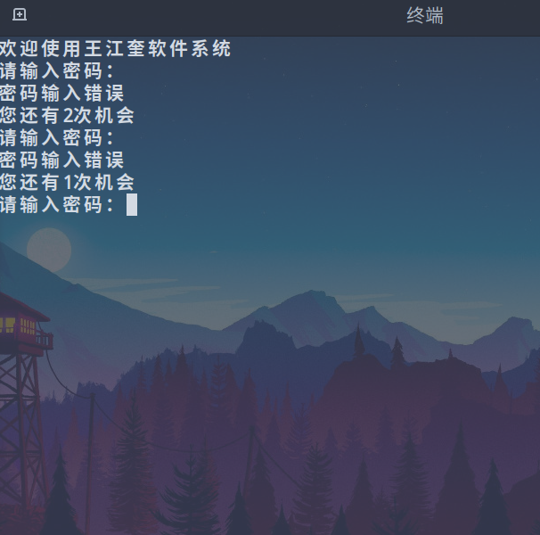
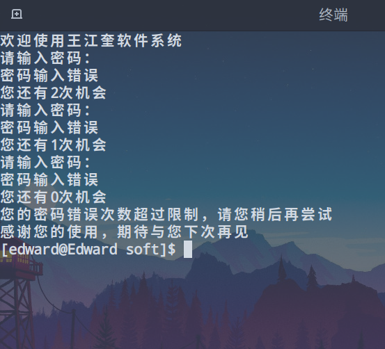
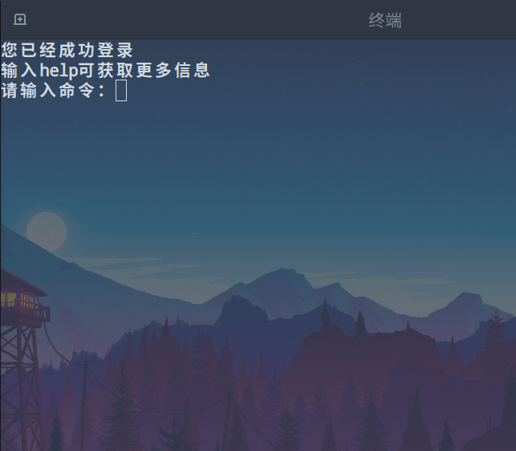
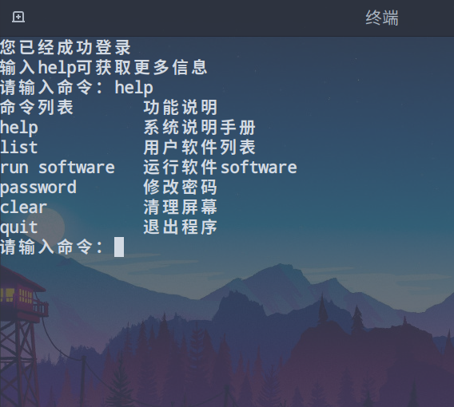
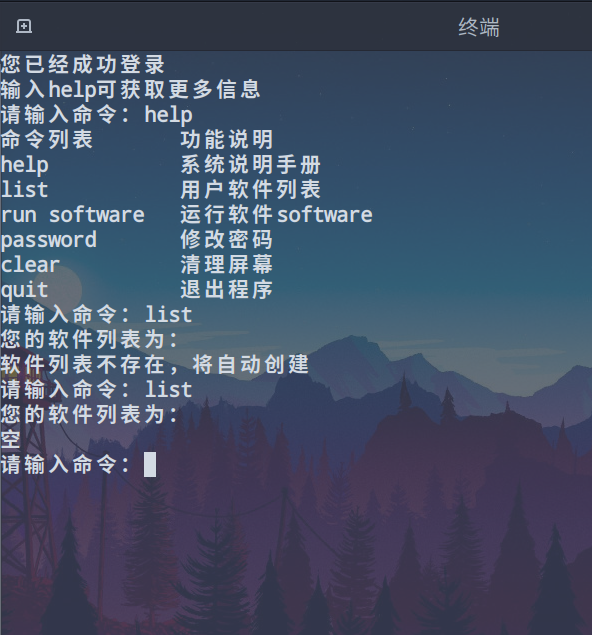
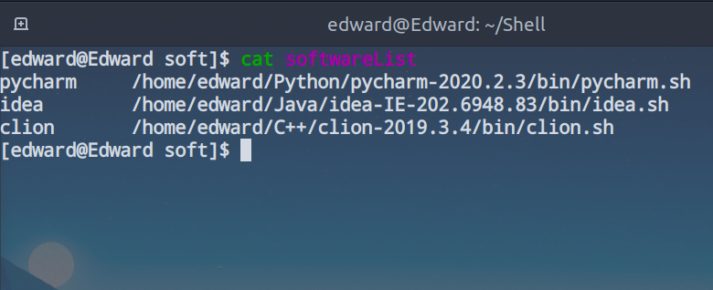
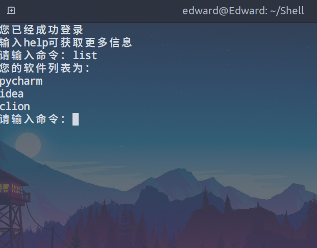
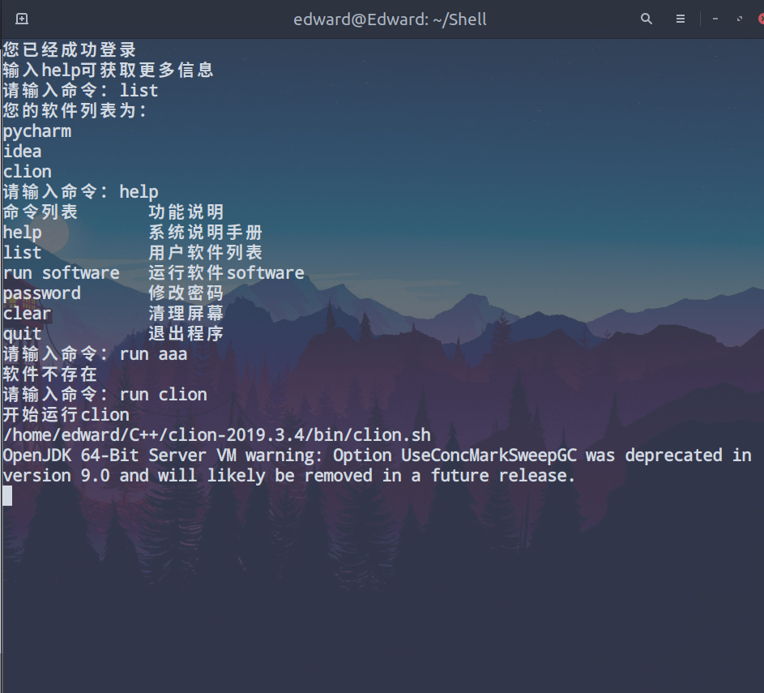
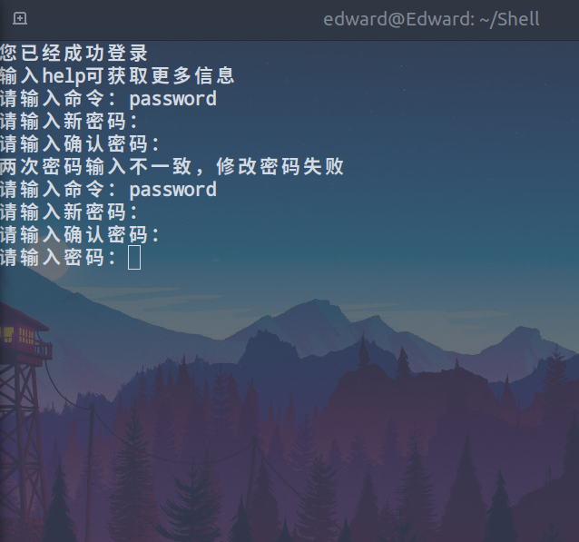
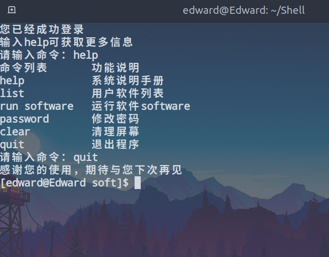

该Linux Shell脚本是一个简易的软件管理系统，是我用来熟悉Shell语法写的一个小工具，因此比较简陋。


### 软件功能：

- 登录系统

- 系统说明手册
- 显示用户软件列表（需要手动添加）
- 运行软件列表中的软件
- 修改登录密码
- 清理屏幕
- 退出程序


### 功能说明

#### 登录系统

用户在刚运行脚本的时候，会自动检查当前目录下的`password`文件中的密码，如果没有该文件会自动创建`password`文件，并在里面写入`123456`作为初始密码


输入密码后会成功登录，如果输入失败会提示失败和剩余尝试次数






输入正确的密码后就会进入命令界面



#### 系统说明手册

在命令界面输入`help`，就可以看到所有的命令



#### 用户软件列表

在命令界面输入`list`，脚本会从当前目录下的`softwareList`文件中读取软件列表，文件的格式为

```
软件名称	脚本地址（绝对地址）
```

如果没有该文件会自动创建一个文件，默认为空，用户可以在文件中添加软件



如果文件中有软件地址，例如：





#### 运行软件列表中的软件

输入`run software`就会运行软件`software`，如果软件不存在会报错



#### 修改登录密码

输入`password`会进入修改密码的模式，如果修改的新密码和确认密码不同修改会失败，如果相同会将新密码写入`password`文件中，并要求重新进行登录



#### 清理屏幕

输入`clear`会清理系统前面打印的信息

#### 退出程序

输入`quit`会退出该系统

